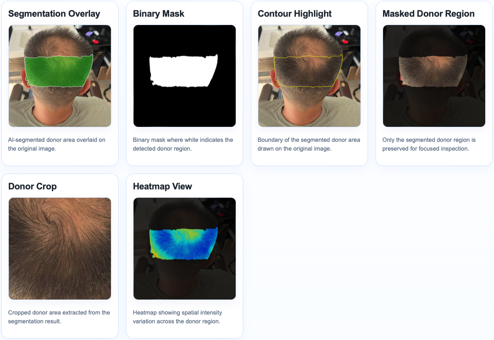
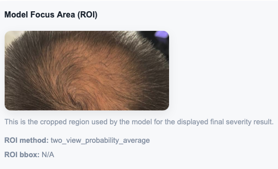
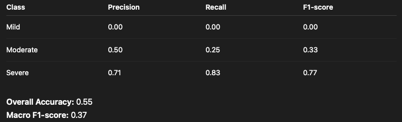
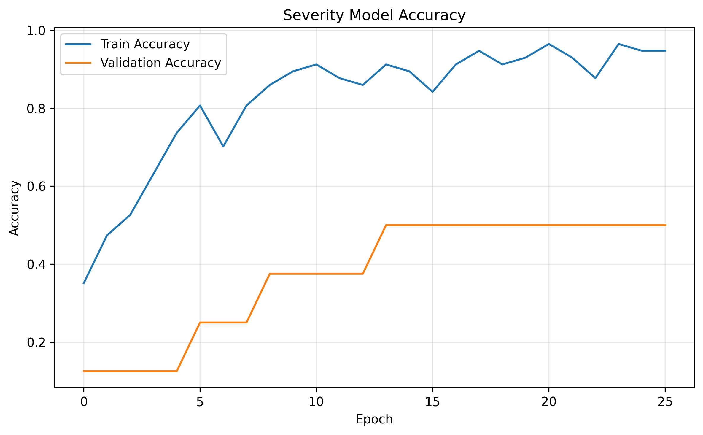
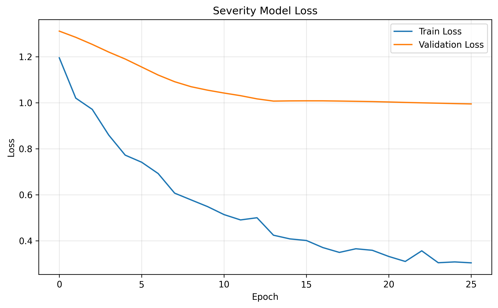
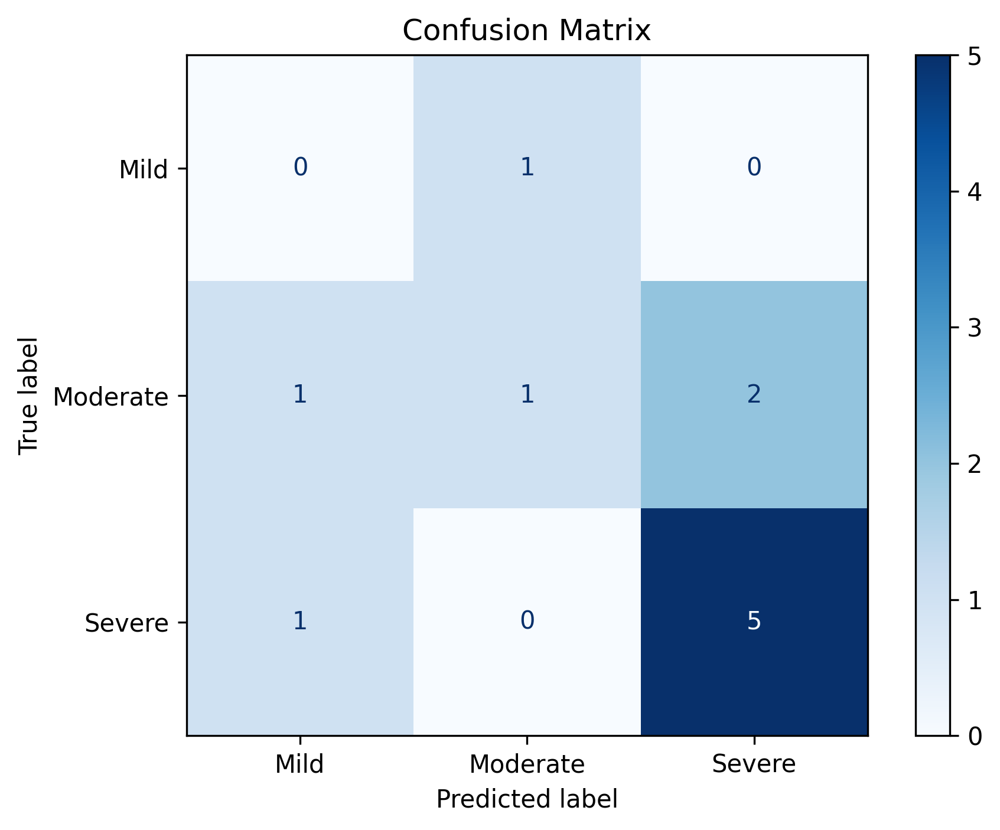
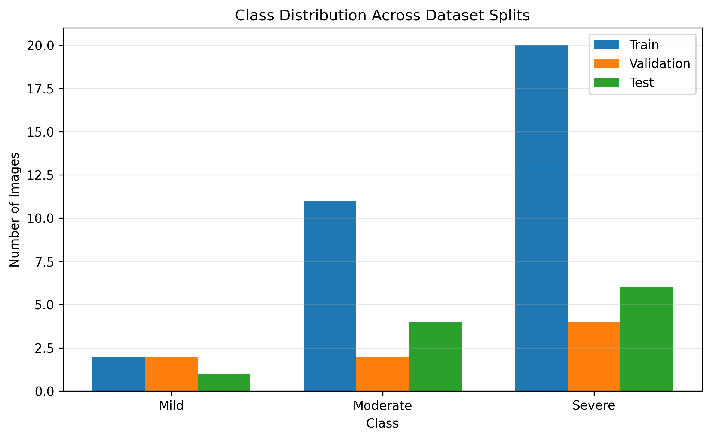
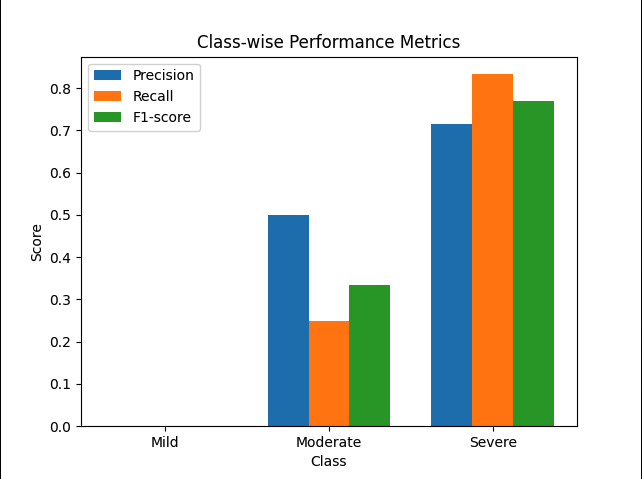

<h1 align="center">Hair Transplant AI Showcase</h1>
<h3 align="center">AI-Powered Hair Transplant Analysis and Consultation Support System</h3>

  

---

## Overview

This project was developed as part of my final-year Computer Science work, focusing on AI-assisted analysis for hair transplant consultations.

The system combines image processing, segmentation, and deep learning models to assist with:

- Donor area analysis
- Hair loss severity estimation
- Suitability assessment
- ROI extraction
- Visual AI outputs for consultation support
- Confidence-aware prediction logic

---

## Key Features

- AI-powered donor segmentation
- Hair density analysis
- Hair loss severity classification
- ROI extraction pipeline
- Confidence scoring
- Heatmap visualization
- Binary mask generation
- Contour detection
- PDF report generation
- Image quality validation

---

## Donor Segmentation Results

  

The system generates multiple AI-assisted visual outputs including segmentation overlays, binary masks, contour detection, cropped donor regions, and heatmap visualizations for donor area analysis.

---

## ROI Extraction

  

The ROI extraction pipeline isolates clinically relevant scalp regions before severity analysis and AI inference.

---

## Segmentation Overlay Output

  

Visual segmentation overlays are generated to help identify donor boundaries and support consultation visualization.

---

## Model Evaluation

  

The severity classification model was evaluated using precision, recall, F1-score, and overall accuracy metrics across multiple severity classes.

---

## Accuracy Curve

  

Training accuracy curves were monitored during model development to evaluate convergence and learning stability.

---

## Loss Curve

  

Loss curves were analyzed to monitor optimization performance and potential overfitting during training.

---

## Confusion Matrix

  

The confusion matrix highlights prediction distribution across multiple severity classes.

---

## Class Distribution

  

Dataset class distribution analysis was used to better understand model balance and training behavior.

---

## Class-wise Performance Metrics

  

Detailed evaluation metrics were calculated for each prediction class including precision, recall, and F1-score.

---

## System Architecture

  

The system architecture combines frontend interaction, backend processing, computer vision pipelines, and AI inference modules.

---

## AI & Computer Vision

The system integrates multiple AI and image-processing techniques including:

- CNN-based classification
- ROI extraction
- Segmentation models
- Computer Vision pipelines
- Confidence-aware prediction logic
- Morphological image processing
- Image validation and preprocessing

---

## Tech Stack

### Frontend
- React
- TypeScript
- Tailwind CSS

### Backend
- Flask
- Python

### AI / ML
- TensorFlow
- OpenCV
- NumPy
- CNNs
- Computer Vision

### Database / Storage
- PostgreSQL
- File-based image processing pipeline

---

## System Workflow

1. Image upload
2. Image validation
3. ROI extraction
4. Donor segmentation
5. Severity prediction
6. Suitability assessment
7. Heatmap and visualization generation
8. PDF report generation

---

## Project Goals

The goal of this project is to explore how AI and Computer Vision technologies can support hair transplant consultation processes through automated image analysis and intelligent visual feedback.

---

## Project Status

This project is currently under active development and improvement.

Source code is kept private due to ongoing development and project confidentiality.

---

## Future Improvements

- Multi-image analysis
- Improved prediction accuracy
- Enhanced clinical reporting
- Expanded AI explainability
- Better segmentation refinement
- Mobile optimization
- Real-time consultation support

---

## Author

Utku Demirel

Final-year Computer Science student at UWE Bristol focused on AI, Computer Vision, and Full Stack Development.
